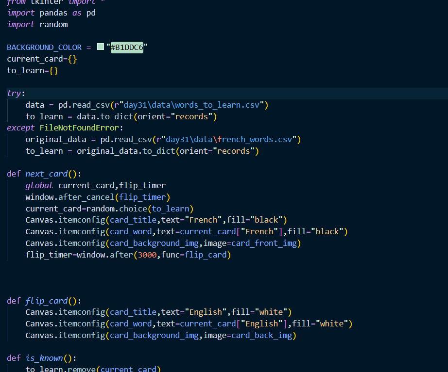
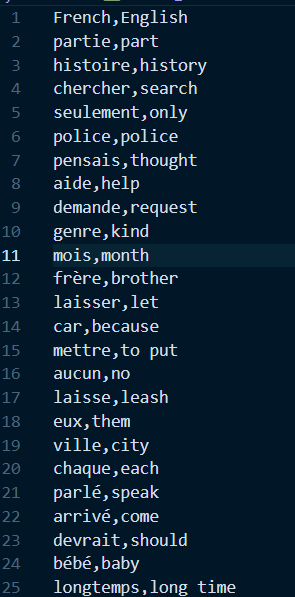
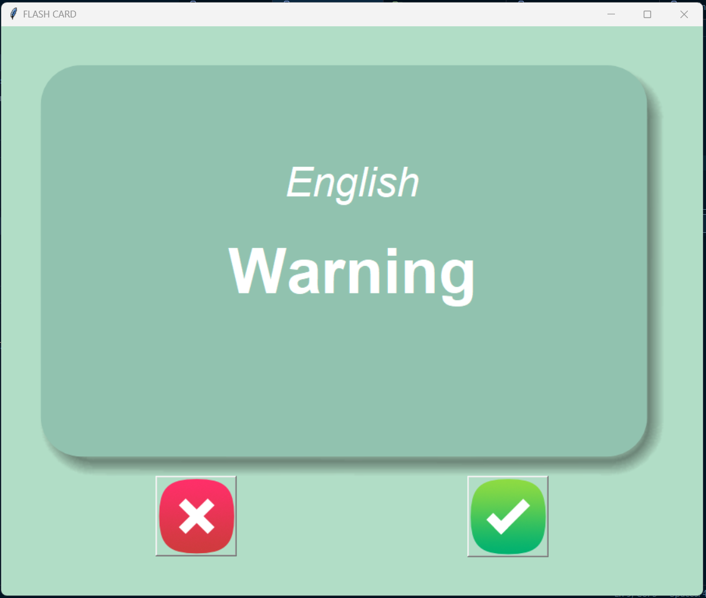

# Flashcard Learning App (French to English)

This is a simple Flashcard Learning App built with Python and Tkinter.  
It helps you practice French words and their English meanings.

---

## 📌 What I Used in This Project
- Python  
- Tkinter (GUI)  
- Pandas (Data handling)  
- Random module  
- Exception Handling (try–except)  
- File Handling (CSV read/write)  

---

## 📂 Project Files
- main.py  
- data/french_words.csv  
- data/words_to_learn.csv (created automatically)  
- images/ (card_front.png, card_back.png, right.png, wrong.png)  

---

## 🖼️ Screenshots

### 🔹 Code
  
*This shows the Python code used to build the flashcard app.*

---

### 🔹 CSV File
  
*This is the CSV file that stores French words and their English translations.*

---

### 🔹 App Interface
  
*This is the app interface where the flashcards are displayed with buttons to mark known/unknown words.*

---

## 🚀 How to Run
1. Install Python 3.x  
2. Install Pandas → `pip install pandas`  
3. Run the program → `python main.py`  
